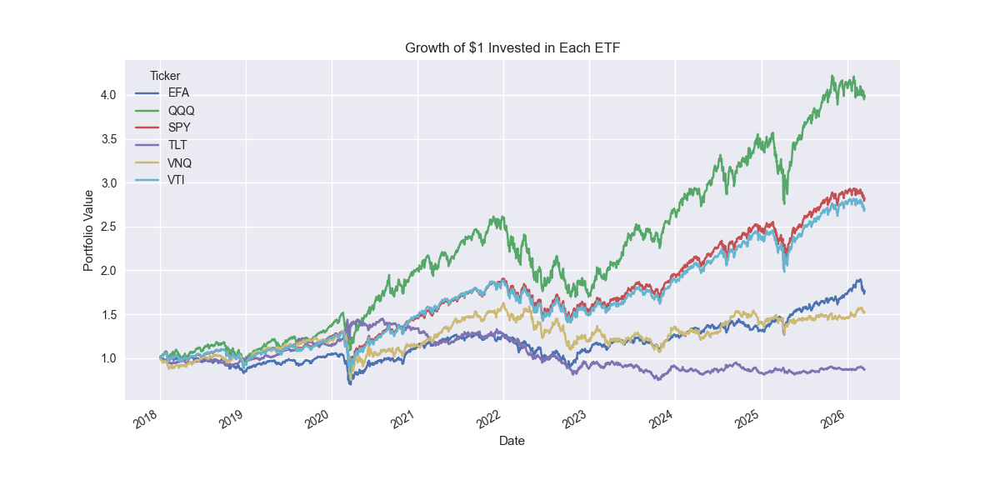
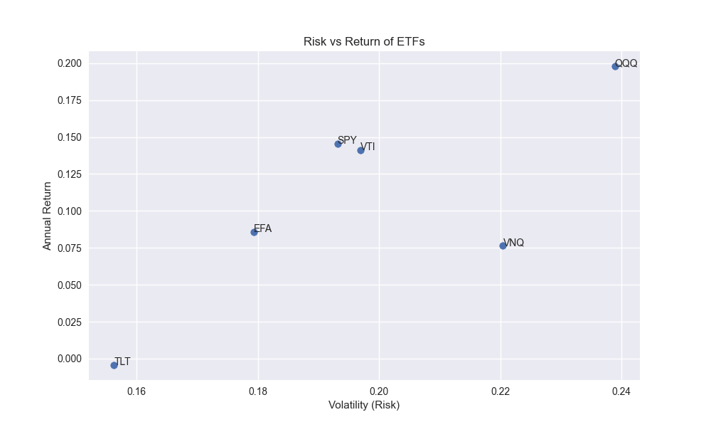
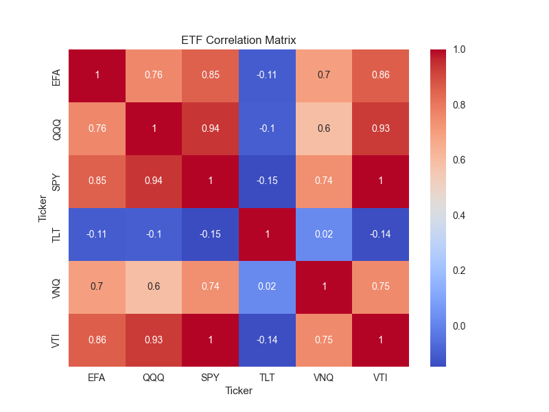
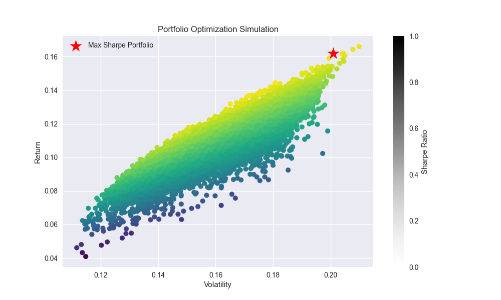
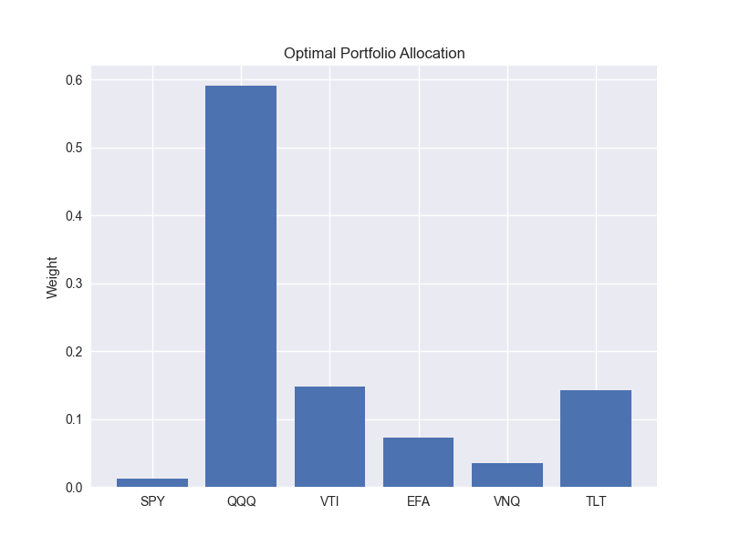

# Multi-Asset ETF Portfolio Strategy Analysis

This project analyzes the performance of a diversified portfolio of exchange-traded funds (ETFs) representing major global asset classes. The goal is to understand how different asset allocations influence portfolio risk and return over time.

Rather than investing in a single asset class, investors typically construct portfolios that combine equities, bonds, real estate, and other assets. Diversification allows investors to reduce risk while maintaining attractive long-term returns.

Using historical market data, this project evaluates how different assets interact within a portfolio and demonstrates how portfolio optimization techniques can be used to identify efficient allocations.

The analysis is implemented in Python using financial data from Yahoo Finance.

---

# Assets Analyzed

The portfolio includes ETFs representing several key segments of the global financial market.

• **SPY** — S&P 500 (U.S. large-cap equities)  
• **QQQ** — Nasdaq 100 (technology-focused equities)  
• **VTI** — Total U.S. stock market  
• **EFA** — International developed market equities  
• **VNQ** — U.S. real estate investment trusts (REITs)  
• **TLT** — Long-term U.S. Treasury bonds  

Each ETF represents a different asset class, allowing us to study diversification within a multi-asset portfolio.

---

# Methodology

The analysis follows a standard portfolio construction workflow commonly used in quantitative finance and investment research.

### Data Collection

Historical ETF price data is downloaded from Yahoo Finance. Adjusted closing prices are used so that dividends and stock splits are properly accounted for.

### Return Calculation

Daily returns are calculated from historical prices. Returns are used rather than raw prices because they allow assets with different price levels to be compared on the same scale.

### Correlation Analysis

A correlation matrix is generated to understand how assets move relative to one another. Lower correlations between assets generally improve diversification benefits within a portfolio.

### Portfolio Simulation

Monte Carlo simulation is used to generate thousands of potential portfolio allocations. Each simulated portfolio assigns random weights to the ETFs while ensuring the total weight sums to 1.

For each portfolio we calculate:

• Expected return  
• Portfolio volatility  
• Sharpe ratio  

### Portfolio Optimization

After simulating many portfolios, the allocation with the highest Sharpe ratio is identified. The Sharpe ratio measures the amount of return achieved per unit of risk taken.

---

# Key Visualizations

The project produces several visualizations to interpret the results.

---

## Growth of $1 Invested

This chart shows how $1 invested in the portfolio would have grown over time.

---

## Risk vs Return

Each point represents a simulated portfolio. The optimal portfolio lies on the efficient frontier where expected return is highest for a given level of risk.

---

## Correlation Matrix

The correlation heatmap illustrates how strongly each asset moves relative to the others.

Lower correlations improve diversification benefits.

---

## Portfolio Simulation

This chart visualizes thousands of simulated portfolios and highlights the optimal allocation.

---

## Optimal Portfolio Allocation

The optimal portfolio weights show how capital should be distributed across the ETFs to maximize risk-adjusted return.

---

# Tools Used

The analysis was implemented using the following tools:

• **Python** — core programming language  
• **Pandas** — data manipulation and time-series analysis  
• **NumPy** — numerical computation  
• **Matplotlib** — financial visualization  
• **Seaborn** — statistical visualization  
• **yfinance** — historical market data  

Development environment:

• Visual Studio Code  
• Jupyter Notebook  

Version control:

• Git  
• GitHub

---

# Notes

This project uses historical data to demonstrate portfolio construction and optimization techniques. It does not incorporate transaction costs, taxes, or forward-looking return assumptions.

The results should therefore be interpreted as an educational demonstration rather than an investment recommendation.
